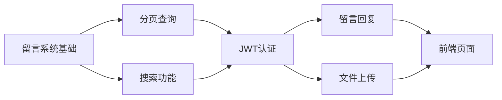

# Go 留言系统项目实战

> 🎯 **目标**：使用 Go 语言实现一个完整的留言系统，包含 CRUD 操作和数据库连接
> 📅 **创建时间**：2024-12-24

---

## 📁 项目结构

```
message-board/
├── main.go              # 主入口文件
├── go.mod               # Go 模块文件
├── config/
│   └── database.go      # 数据库配置
├── models/
│   └── message.go       # 留言模型
├── handlers/
│   └── message.go       # 留言处理器
├── routes/
│   └── routes.go        # 路由配置
└── README.md
```

---

## 🛠️ 技术栈

| 技术 | 说明 |
|------|------|
| **Go** | 后端语言 |
| **Gin** | Web 框架 |
| **GORM** | ORM 框架 |
| **MySQL/SQLite** | 数据库 |

---

## 📦 初始化项目

### 1. 创建项目目录

```bash
mkdir message-board
cd message-board
go mod init message-board
```

### 2. 安装依赖

```bash
# Gin Web 框架
go get -u github.com/gin-gonic/gin

# GORM ORM 框架
go get -u gorm.io/gorm

# 数据库驱动 (选择其一)
go get -u gorm.io/driver/mysql    # MySQL
go get -u gorm.io/driver/sqlite   # SQLite (更简单，推荐学习使用)
```

---

## 💾 数据库配置

### `config/database.go`

```go
package config

import (
	"log"

	"gorm.io/driver/sqlite"
	"gorm.io/gorm"
)

var DB *gorm.DB

// InitDB 初始化数据库连接
func InitDB() {
	var err error
	
	// 使用 SQLite (简单易用，无需安装数据库)
	DB, err = gorm.Open(sqlite.Open("messages.db"), &gorm.Config{})
	
	// 如果使用 MySQL，替换为:
	// dsn := "user:password@tcp(127.0.0.1:3306)/message_board?charset=utf8mb4&parseTime=True&loc=Local"
	// DB, err = gorm.Open(mysql.Open(dsn), &gorm.Config{})
	
	if err != nil {
		log.Fatal("数据库连接失败:", err)
	}
	
	log.Println("✅ 数据库连接成功!")
}
```

---

## 📝 数据模型

### `models/message.go`

```go
package models

import (
	"time"

	"gorm.io/gorm"
)

// Message 留言模型
type Message struct {
	ID        uint           `json:"id" gorm:"primaryKey"`
	Author    string         `json:"author" gorm:"size:100;not null"`        // 留言作者
	Content   string         `json:"content" gorm:"type:text;not null"`      // 留言内容
	Email     string         `json:"email" gorm:"size:100"`                  // 邮箱 (可选)
	CreatedAt time.Time      `json:"created_at"`                             // 创建时间
	UpdatedAt time.Time      `json:"updated_at"`                             // 更新时间
	DeletedAt gorm.DeletedAt `json:"-" gorm:"index"`                         // 软删除
}

// TableName 自定义表名
func (Message) TableName() string {
	return "messages"
}
```

---

## 🎮 CRUD 处理器

### `handlers/message.go`

```go
package handlers

import (
	"message-board/config"
	"message-board/models"
	"net/http"

	"github.com/gin-gonic/gin"
)

// CreateMessageInput 创建留言的输入结构
type CreateMessageInput struct {
	Author  string `json:"author" binding:"required"`
	Content string `json:"content" binding:"required"`
	Email   string `json:"email"`
}

// UpdateMessageInput 更新留言的输入结构
type UpdateMessageInput struct {
	Author  string `json:"author"`
	Content string `json:"content"`
	Email   string `json:"email"`
}

// ========== CREATE ==========

// CreateMessage 创建留言
func CreateMessage(c *gin.Context) {
	var input CreateMessageInput
	
	// 绑定并验证输入
	if err := c.ShouldBindJSON(&input); err != nil {
		c.JSON(http.StatusBadRequest, gin.H{
			"error": "请填写作者和内容",
		})
		return
	}
	
	// 创建留言
	message := models.Message{
		Author:  input.Author,
		Content: input.Content,
		Email:   input.Email,
	}
	
	if err := config.DB.Create(&message).Error; err != nil {
		c.JSON(http.StatusInternalServerError, gin.H{
			"error": "创建留言失败",
		})
		return
	}
	
	c.JSON(http.StatusCreated, gin.H{
		"message": "留言创建成功",
		"data":    message,
	})
}

// ========== READ ==========

// GetMessages 获取所有留言
func GetMessages(c *gin.Context) {
	var messages []models.Message
	
	// 按创建时间倒序排列
	if err := config.DB.Order("created_at desc").Find(&messages).Error; err != nil {
		c.JSON(http.StatusInternalServerError, gin.H{
			"error": "获取留言列表失败",
		})
		return
	}
	
	c.JSON(http.StatusOK, gin.H{
		"data":  messages,
		"total": len(messages),
	})
}

// GetMessage 获取单个留言
func GetMessage(c *gin.Context) {
	var message models.Message
	id := c.Param("id")
	
	if err := config.DB.First(&message, id).Error; err != nil {
		c.JSON(http.StatusNotFound, gin.H{
			"error": "留言不存在",
		})
		return
	}
	
	c.JSON(http.StatusOK, gin.H{
		"data": message,
	})
}

// ========== UPDATE ==========

// UpdateMessage 更新留言
func UpdateMessage(c *gin.Context) {
	var message models.Message
	id := c.Param("id")
	
	// 查找留言
	if err := config.DB.First(&message, id).Error; err != nil {
		c.JSON(http.StatusNotFound, gin.H{
			"error": "留言不存在",
		})
		return
	}
	
	// 绑定更新数据
	var input UpdateMessageInput
	if err := c.ShouldBindJSON(&input); err != nil {
		c.JSON(http.StatusBadRequest, gin.H{
			"error": err.Error(),
		})
		return
	}
	
	// 更新留言
	config.DB.Model(&message).Updates(models.Message{
		Author:  input.Author,
		Content: input.Content,
		Email:   input.Email,
	})
	
	c.JSON(http.StatusOK, gin.H{
		"message": "留言更新成功",
		"data":    message,
	})
}

// ========== DELETE ==========

// DeleteMessage 删除留言
func DeleteMessage(c *gin.Context) {
	var message models.Message
	id := c.Param("id")
	
	// 查找留言
	if err := config.DB.First(&message, id).Error; err != nil {
		c.JSON(http.StatusNotFound, gin.H{
			"error": "留言不存在",
		})
		return
	}
	
	// 删除留言 (软删除)
	config.DB.Delete(&message)
	
	c.JSON(http.StatusOK, gin.H{
		"message": "留言删除成功",
	})
}
```

---

## 🛤️ 路由配置

### `routes/routes.go`

```go
package routes

import (
	"message-board/handlers"

	"github.com/gin-gonic/gin"
)

// SetupRoutes 配置路由
func SetupRoutes(r *gin.Engine) {
	// API 路由组
	api := r.Group("/api")
	{
		messages := api.Group("/messages")
		{
			messages.POST("", handlers.CreateMessage)       // 创建留言
			messages.GET("", handlers.GetMessages)          // 获取所有留言
			messages.GET("/:id", handlers.GetMessage)       // 获取单个留言
			messages.PUT("/:id", handlers.UpdateMessage)    // 更新留言
			messages.DELETE("/:id", handlers.DeleteMessage) // 删除留言
		}
	}
}
```

---

## 🚀 主入口文件

### `main.go`

```go
package main

import (
	"log"
	"message-board/config"
	"message-board/models"
	"message-board/routes"

	"github.com/gin-gonic/gin"
)

func main() {
	// 初始化数据库
	config.InitDB()
	
	// 自动迁移数据库表
	config.DB.AutoMigrate(&models.Message{})
	log.Println("✅ 数据库表迁移完成!")
	
	// 创建 Gin 引擎
	r := gin.Default()
	
	// 配置路由
	routes.SetupRoutes(r)
	
	// 首页
	r.GET("/", func(c *gin.Context) {
		c.JSON(200, gin.H{
			"message": "🎉 欢迎使用留言系统 API",
			"version": "1.0.0",
		})
	})
	
	// 启动服务器
	log.Println("🚀 服务器启动在 http://localhost:8080")
	r.Run(":8080")
}
```

---

## 🧪 API 测试

### 使用 cURL 测试

```bash
# 1. 创建留言 (Create)
curl -X POST http://localhost:8080/api/messages \
  -H "Content-Type: application/json" \
  -d '{"author": "张三", "content": "这是一条测试留言", "email": "zhangsan@example.com"}'

# 2. 获取所有留言 (Read - List)
curl http://localhost:8080/api/messages

# 3. 获取单个留言 (Read - Single)
curl http://localhost:8080/api/messages/1

# 4. 更新留言 (Update)
curl -X PUT http://localhost:8080/api/messages/1 \
  -H "Content-Type: application/json" \
  -d '{"content": "这是更新后的内容"}'

# 5. 删除留言 (Delete)
curl -X DELETE http://localhost:8080/api/messages/1
```

---

## 📊 API 接口一览

| 方法 | 路径 | 说明 |
|------|------|------|
| `POST` | `/api/messages` | 创建留言 |
| `GET` | `/api/messages` | 获取所有留言 |
| `GET` | `/api/messages/:id` | 获取单个留言 |
| `PUT` | `/api/messages/:id` | 更新留言 |
| `DELETE` | `/api/messages/:id` | 删除留言 |

---

## 🎯 运行项目

```bash
# 进入项目目录
cd message-board

# 运行项目
go run main.go

# 或者编译后运行
go build -o message-board
./message-board
```

---

## 📚 扩展学习

### 进阶功能笔记 (点击跳转)

| 功能 | 笔记链接 | 难度 | 说明 |
|------|----------|------|------|
| 📄 **分页查询** | [[分页查询实现]] | ⭐⭐ | 实现分页获取留言列表 |
| 🔍 **搜索功能** | [[搜索功能实现]] | ⭐⭐ | 按关键词、作者、时间搜索 |
| 🔐 **用户认证** | [[JWT用户认证]] | ⭐⭐⭐ | JWT Token 登录注册认证 |
| 💬 **留言回复** | [[留言回复功能]] | ⭐⭐⭐ | 多级嵌套回复，树形结构 |
| 📁 **文件上传** | [[文件上传实现]] | ⭐⭐⭐ | 图片附件上传功能 |
| 🖥️ **前端页面** | [[Vue前端页面]] | ⭐⭐⭐ | Vue 3 + Vite 前端实现 |

### 学习路径



### 相关资源

- [Gin 官方文档](https://gin-gonic.com/docs/)
- [GORM 官方文档](https://gorm.io/docs/)
- [Go 官方教程](https://go.dev/learn/)

---

## 🗺️ 笔记导航

```
📂 go/
├── 📄 留言系统项目实战 (当前笔记)
├── 📄 [[分页查询实现]]
├── 📄 [[搜索功能实现]]
├── 📄 [[JWT用户认证]]
├── 📄 [[留言回复功能]]
├── 📄 [[文件上传实现]]
└── 📄 [[Vue前端页面]]
```

---

## 🏷️ 标签

#Go #Gin #GORM #CRUD #后端开发 #项目实战
