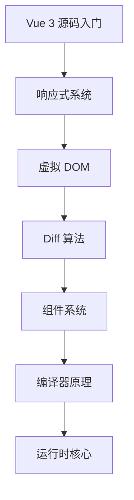

# Vue 3 源码实战笔记

> 🎯 **目标**：深入理解 Vue 3 核心源码，掌握响应式原理、虚拟 DOM、编译器等核心模块
> 📅 **创建时间**：2024-12-24

---

## 📚 源码学习路径



---

## 🏗️ Vue 3 源码结构

Vue 3 采用 **Monorepo** 架构，使用 pnpm workspace 管理多个包：

```
packages/
├── reactivity/          # 响应式系统 (独立可用)
├── runtime-core/        # 运行时核心 (平台无关)
├── runtime-dom/         # 浏览器运行时
├── compiler-core/       # 编译器核心 (平台无关)
├── compiler-dom/        # 浏览器编译器
├── compiler-sfc/        # 单文件组件编译器
├── vue/                 # 完整构建入口
├── shared/              # 共享工具函数
└── ...
```

---

## 📖 核心模块笔记

### 响应式系统 `@vue/reactivity`

| 笔记 | 内容 | 难度 |
|------|------|------|
| [[响应式原理-reactive]] | reactive/ref 实现原理 | ⭐⭐⭐ |
| [[响应式原理-effect]] | effect 副作用函数 | ⭐⭐⭐ |
| [[响应式原理-computed]] | computed 计算属性 | ⭐⭐⭐ |
| [[响应式原理-watch]] | watch/watchEffect | ⭐⭐⭐ |

### 虚拟 DOM 与 Diff

| 笔记 | 内容 | 难度 |
|------|------|------|
| [[虚拟DOM-VNode]] | VNode 节点结构 | ⭐⭐⭐ |
| [[Diff算法详解]] | 快速 Diff 算法 | ⭐⭐⭐⭐ |
| [[Renderer渲染器]] | 渲染器实现 | ⭐⭐⭐⭐ |

### 组件系统

| 笔记 | 内容 | 难度 |
|------|------|------|
| [[组件实例化流程]] | 组件挂载过程 | ⭐⭐⭐ |
| [[生命周期实现]] | 生命周期钩子原理 | ⭐⭐⭐ |
| [[Props和Emit]] | 组件通信机制 | ⭐⭐ |

### 编译器 `@vue/compiler-core`

| 笔记 | 内容 | 难度 |
|------|------|------|
| [[模板编译流程]] | Parse → Transform → Generate | ⭐⭐⭐⭐ |
| [[AST抽象语法树]] | 模板 AST 结构 | ⭐⭐⭐⭐ |
| [[编译优化策略]] | 静态提升、补丁标记 | ⭐⭐⭐⭐ |

---

## 🛠️ 环境准备

### 1. 克隆源码

```bash
git clone https://github.com/vuejs/core.git vue3-source
cd vue3-source
```

### 2. 安装依赖

```bash
# 需要使用 pnpm
npm install -g pnpm
pnpm install
```

### 3. 构建项目

```bash
# 构建所有包
pnpm build

# 开发模式 (监听变化)
pnpm dev
```

### 4. 调试源码

```bash
# 在 packages/vue/examples 下创建测试文件
# 开启 sourceMap 调试
pnpm dev --sourcemap
```

---

## 🔍 源码阅读技巧

### 推荐阅读顺序

1. **`@vue/shared`** - 先了解工具函数
2. **`@vue/reactivity`** - 响应式系统 (可独立运行)
3. **`@vue/runtime-core`** - 运行时核心
4. **`@vue/compiler-core`** - 编译器核心

### 调试技巧

```javascript
// 在源码中添加 debugger
export function reactive(target) {
  debugger // 断点调试
  return createReactiveObject(target, ...)
}
```

### 使用 VSCode 调试

```json
// .vscode/launch.json
{
  "version": "0.2.0",
  "configurations": [
    {
      "type": "chrome",
      "request": "launch",
      "name": "Debug Vue",
      "url": "http://localhost:3000",
      "webRoot": "${workspaceFolder}"
    }
  ]
}
```

---

## 📊 核心概念速览

### 响应式核心 API

| API | 说明 | 源码位置 |
|-----|------|----------|
| `reactive` | 深度响应式代理 | `packages/reactivity/src/reactive.ts` |
| `ref` | 值类型响应式 | `packages/reactivity/src/ref.ts` |
| `effect` | 副作用函数 | `packages/reactivity/src/effect.ts` |
| `computed` | 计算属性 | `packages/reactivity/src/computed.ts` |
| `watch` | 监听器 | `packages/runtime-core/src/apiWatch.ts` |

### 渲染器核心

| 概念 | 说明 | 源码位置 |
|------|------|----------|
| `VNode` | 虚拟节点 | `packages/runtime-core/src/vnode.ts` |
| `patch` | Diff 入口 | `packages/runtime-core/src/renderer.ts` |
| `mount` | 挂载逻辑 | `packages/runtime-core/src/renderer.ts` |
| `update` | 更新逻辑 | `packages/runtime-core/src/renderer.ts` |

---

## 🗺️ 笔记导航

```
📂 vue/
├── 📄 Vue3源码实战笔记 (当前笔记)
│
├── 📂 响应式系统/
│   ├── [[响应式原理-reactive]]
│   ├── [[响应式原理-effect]]
│   ├── [[响应式原理-computed]]
│   └── [[响应式原理-watch]]
│
├── 📂 虚拟DOM/
│   ├── [[虚拟DOM-VNode]]
│   ├── [[Diff算法详解]]
│   └── [[Renderer渲染器]]
│
├── 📂 组件系统/
│   ├── [[组件实例化流程]]
│   ├── [[生命周期实现]]
│   └── [[Props和Emit]]
│
└── 📂 编译器/
    ├── [[模板编译流程]]
    ├── [[AST抽象语法树]]
    └── [[编译优化策略]]
```

---

## 📚 参考资料

- [Vue 3 官方文档](https://vuejs.org/)
- [Vue 3 设计与实现 (霍春阳)](https://www.ituring.com.cn/book/2953)
- [Vue 3 源码仓库](https://github.com/vuejs/core)
- [Vue 3 RFC](https://github.com/vuejs/rfcs)

---

## 🏷️ 标签

#Vue3 #源码分析 #前端 #响应式 #虚拟DOM
