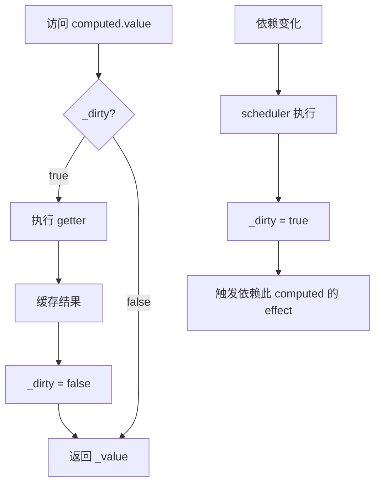

# 响应式原理 - computed

> 🔗 **关联笔记**：[[Vue3源码实战笔记]]
> 📅 **创建时间**：2024-12-24
> 📁 **源码位置**：`packages/reactivity/src/computed.ts`

---

## 📖 概述

`computed` 计算属性具有两个核心特性：
1. **惰性求值**：只有访问时才计算
2. **缓存**：依赖不变时返回缓存值

---

## 🔧 核心实现

### 1. ComputedRefImpl 类

```typescript
// packages/reactivity/src/computed.ts

export class ComputedRefImpl<T> {
  public dep?: Dep = undefined
  
  private _value!: T
  public readonly effect: ReactiveEffect<T>
  
  public readonly __v_isRef = true
  
  // 脏值标记：true 表示需要重新计算
  public _dirty = true
  
  constructor(
    getter: ComputedGetter<T>,
    private readonly _setter: ComputedSetter<T>
  ) {
    // 创建 effect，但使用调度器控制执行
    this.effect = new ReactiveEffect(getter, () => {
      // 依赖变化时，不立即执行，只标记为脏
      if (!this._dirty) {
        this._dirty = true
        // 触发依赖于 computed 的 effect
        triggerRefValue(this)
      }
    })
    
    this.effect.computed = this
  }
  
  get value() {
    // 收集依赖 (computed 也可以被 effect 依赖)
    trackRefValue(this)
    
    // 只有脏时才重新计算
    if (this._dirty) {
      this._dirty = false
      // 执行 getter，获取新值
      this._value = this.effect.run()!
    }
    
    return this._value
  }
  
  set value(newValue: T) {
    this._setter(newValue)
  }
}
```

### 2. computed 函数入口

```typescript
export function computed<T>(
  getterOrOptions: ComputedGetter<T> | WritableComputedOptions<T>
) {
  let getter: ComputedGetter<T>
  let setter: ComputedSetter<T>
  
  // 处理参数
  const onlyGetter = isFunction(getterOrOptions)
  if (onlyGetter) {
    getter = getterOrOptions
    setter = NOOP // 只读
  } else {
    getter = getterOrOptions.get
    setter = getterOrOptions.set
  }
  
  // 创建 ComputedRefImpl 实例
  return new ComputedRefImpl(getter, setter)
}
```

---

## 🎯 懒执行与缓存

### 执行流程



### 为什么需要 scheduler？

```typescript
// 如果不用 scheduler，依赖变化会立即执行 getter
// 可能导致多次无用计算

const count = ref(1)
const double = computed(() => {
  console.log('computed!')
  return count.value * 2
})

// 不访问 double，不应该计算
count.value = 2 // 如果没有 scheduler，会输出 computed!
count.value = 3 // 又输出 computed!

// 最后才访问
console.log(double.value) // 应该只计算一次
```

---

## 🔗 computed 的双重身份

computed 既是 **effect**（依赖其他响应式数据），也是**响应式数据**（可被其他 effect 依赖）。

```typescript
const count = ref(1)

// computed 依赖 count
const double = computed(() => count.value * 2)

// effect 依赖 computed
effect(() => {
  console.log(double.value) // double 被收集
})

count.value++ // 触发链式更新
// 1. count 变化 → double 的 scheduler 执行
// 2. double._dirty = true
// 3. 触发依赖 double 的 effect
// 4. effect 执行时访问 double.value
// 5. 因为 _dirty = true，重新计算
```

---

## 🧪 手写简易 computed

```javascript
function computed(getterOrOptions) {
  let getter, setter
  
  if (typeof getterOrOptions === 'function') {
    getter = getterOrOptions
    setter = () => {
      console.warn('computed is readonly')
    }
  } else {
    getter = getterOrOptions.get
    setter = getterOrOptions.set
  }
  
  let value
  let dirty = true
  
  // 创建 effect，使用调度器
  const _effect = new ReactiveEffect(getter, () => {
    if (!dirty) {
      dirty = true
      // 触发依赖
      trigger(obj, 'value')
    }
  })
  
  const obj = {
    get value() {
      // 收集依赖
      track(obj, 'value')
      
      if (dirty) {
        value = _effect.run()
        dirty = false
      }
      return value
    },
    set value(newValue) {
      setter(newValue)
    }
  }
  
  return obj
}

// ========== 测试 ==========
const count = reactive({ value: 1 })

const double = computed(() => {
  console.log('computed!')  
  return count.value * 2
})

console.log(double.value) // computed! 2
console.log(double.value) // 2 (缓存，不重新计算)

count.value = 5
console.log(double.value) // computed! 10
```

---

## 📊 与 watch 的区别

| 特性 | computed | watch |
|------|----------|-------|
| 返回值 | 返回计算结果 | 返回停止函数 |
| 执行时机 | 惰性 (访问时) | 立即 (默认) 或惰性 |
| 缓存 | ✅ 有缓存 | ❌ 无缓存 |
| 用途 | 派生状态 | 副作用 |

---

## 💡 关键点总结

1. **惰性执行**：只有访问 `.value` 时才计算
2. **缓存机制**：`_dirty` 标记控制是否重新计算
3. **scheduler**：依赖变化时不立即计算，只标记脏
4. **双重身份**：既是 effect 消费者，也是响应式数据提供者
5. **链式触发**：依赖变化 → 标记脏 → 触发下游 effect

---

## 📚 相关笔记

- [[Vue3源码实战笔记]] - 主笔记
- [[响应式原理-effect]] - effect 实现
- [[响应式原理-watch]] - watch 实现

---

#Vue3 #响应式 #computed #源码分析
