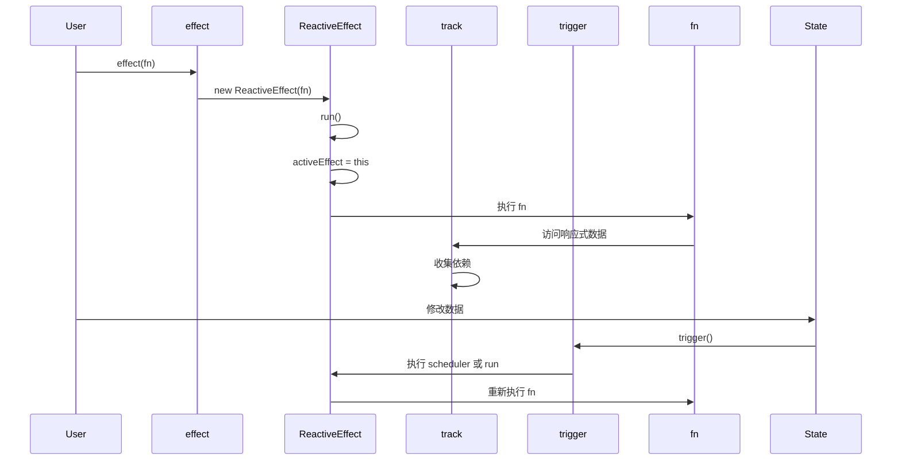

# 响应式原理 - effect

> 🔗 **关联笔记**：[[Vue3源码实战笔记]]
> 📅 **创建时间**：2024-12-24
> 📁 **源码位置**：`packages/reactivity/src/effect.ts`

---

## 📖 概述

`effect` 是 Vue 3 响应式系统的核心，它负责：
1. 执行副作用函数
2. 自动收集依赖
3. 在依赖变化时重新执行

---

## 🔧 核心实现

### 1. ReactiveEffect 类

```typescript
// packages/reactivity/src/effect.ts

export class ReactiveEffect<T = any> {
  active = true                    // 是否激活
  deps: Dep[] = []                 // 依赖集合
  parent: ReactiveEffect | undefined = undefined
  
  // 可选的调度器
  scheduler?: EffectScheduler
  
  constructor(
    public fn: () => T,
    scheduler?: EffectScheduler
  ) {
    this.scheduler = scheduler
  }
  
  run() {
    // 如果已停止，直接执行函数
    if (!this.active) {
      return this.fn()
    }
    
    // 保存当前 effect
    let parent: ReactiveEffect | undefined = activeEffect
    
    try {
      // 设置当前 effect
      this.parent = activeEffect
      activeEffect = this
      
      // 清除旧依赖
      cleanupEffect(this)
      
      // 执行函数，触发依赖收集
      return this.fn()
    } finally {
      // 恢复上一个 effect
      activeEffect = this.parent
      this.parent = undefined
    }
  }
  
  stop() {
    if (this.active) {
      cleanupEffect(this)
      this.active = false
    }
  }
}
```

### 2. effect 函数入口

```typescript
export function effect<T = any>(
  fn: () => T,
  options?: ReactiveEffectOptions
): ReactiveEffectRunner {
  // 创建 ReactiveEffect 实例
  const _effect = new ReactiveEffect(fn)
  
  // 合并选项
  if (options) {
    extend(_effect, options)
  }
  
  // 立即执行一次 (触发依赖收集)
  if (!options || !options.lazy) {
    _effect.run()
  }
  
  // 返回 runner 函数
  const runner = _effect.run.bind(_effect) as ReactiveEffectRunner
  runner.effect = _effect
  
  return runner
}
```

### 3. 清除依赖 (解决分支切换问题)

```typescript
function cleanupEffect(effect: ReactiveEffect) {
  const { deps } = effect
  if (deps.length) {
    for (let i = 0; i < deps.length; i++) {
      deps[i].delete(effect)
    }
    deps.length = 0
  }
}
```

---

## 🎯 为什么需要清除依赖？

### 分支切换问题

```javascript
const state = reactive({ show: true, text: 'hello' })

effect(() => {
  // 当 show 为 true 时，依赖 show 和 text
  // 当 show 为 false 时，只依赖 show
  console.log(state.show ? state.text : 'hidden')
})

state.show = false  // 触发更新
state.text = 'world' // 不应该触发更新！
```

如果不清除依赖，`text` 变化时仍会触发 effect。

---

## ⚡ 调度器 (Scheduler)

调度器可以控制 effect 的执行时机：

```typescript
const state = reactive({ count: 0 })

effect(
  () => {
    console.log(state.count)
  },
  {
    // 自定义调度器
    scheduler(effect) {
      // 异步执行
      setTimeout(() => {
        effect.run()
      }, 0)
    }
  }
)

state.count++
state.count++
state.count++
// 使用调度器后，只会输出最终值 3
```

### Vue 中的调度器应用

```typescript
// 组件更新使用 queueJob 调度
// 避免同步更新导致的性能问题

const effect = new ReactiveEffect(componentUpdateFn, () => {
  queueJob(instance.update)
})
```

---

## 🔄 嵌套 effect

```typescript
const state = reactive({ foo: 1, bar: 2 })

effect(() => {
  console.log('outer', state.foo)
  
  effect(() => {
    console.log('inner', state.bar)
  })
  
  console.log('outer end')
})
```

### 为什么需要 effectStack？

Vue 3.2+ 使用 `parent` 指针替代栈：

```typescript
// 嵌套时的 effect 链
outer.parent = undefined
inner.parent = outer
// 执行完 inner 后
activeEffect = inner.parent // 恢复为 outer
```

---

## 🛑 停止 effect

```typescript
const state = reactive({ count: 0 })

const runner = effect(() => {
  console.log(state.count)
})

state.count++ // 触发

// 停止 effect
runner.effect.stop()

state.count++ // 不再触发
```

---

## 🧪 手写简易 effect

```javascript
let activeEffect = null
const effectStack = []

class ReactiveEffect {
  constructor(fn, scheduler) {
    this.fn = fn
    this.scheduler = scheduler
    this.deps = []
    this.active = true
  }
  
  run() {
    if (!this.active) {
      return this.fn()
    }
    
    // 避免重复收集
    if (effectStack.includes(this)) return
    
    try {
      // 入栈
      effectStack.push(this)
      activeEffect = this
      
      // 清除旧依赖
      this.cleanup()
      
      // 执行，触发依赖收集
      return this.fn()
    } finally {
      // 出栈
      effectStack.pop()
      activeEffect = effectStack[effectStack.length - 1]
    }
  }
  
  cleanup() {
    for (const dep of this.deps) {
      dep.delete(this)
    }
    this.deps.length = 0
  }
  
  stop() {
    if (this.active) {
      this.cleanup()
      this.active = false
    }
  }
}

function effect(fn, options = {}) {
  const _effect = new ReactiveEffect(fn, options.scheduler)
  
  if (!options.lazy) {
    _effect.run()
  }
  
  const runner = _effect.run.bind(_effect)
  runner.effect = _effect
  
  return runner
}

// ========== 测试 ==========
const state = reactive({ count: 0 })

const runner = effect(() => {
  console.log('effect run:', state.count)
})

state.count = 1 // effect run: 1
state.count = 2 // effect run: 2

runner.effect.stop()

state.count = 3 // 不输出
```

---

## 📊 effect 执行流程



---

## 💡 关键点总结

1. **activeEffect**：全局变量，记录当前执行的 effect
2. **依赖收集**：effect 执行时，触发 get，收集依赖
3. **依赖清除**：每次执行前清除旧依赖，解决分支切换问题
4. **调度器**：控制 effect 执行时机，用于批量更新
5. **嵌套支持**：使用 parent 指针支持嵌套 effect

---

## 📚 相关笔记

- [[Vue3源码实战笔记]] - 主笔记
- [[响应式原理-reactive]] - reactive 实现
- [[响应式原理-computed]] - computed 实现

---

#Vue3 #响应式 #effect #源码分析
