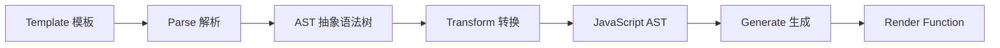

# 模板编译流程

> 🔗 **关联笔记**：[[Vue3源码实战笔记]]
> 📅 **创建时间**：2024-12-24
> 📁 **源码位置**：`packages/compiler-core/src/compile.ts`

---

## 📖 编译三阶段



---

## 🔧 compile 函数

```typescript
function compile(template) {
  // 1. 解析模板，生成 AST
  const ast = parse(template)
  
  // 2. 转换 AST
  transform(ast, {
    nodeTransforms: [
      transformElement,
      transformText,
      transformIf,
      transformFor
    ]
  })
  
  // 3. 生成代码
  const code = generate(ast)
  
  return code
}
```

---

## 📊 示例

```html
<div id="app">
  <p>{{ message }}</p>
</div>
```

编译结果：

```javascript
function render(_ctx) {
  return h('div', { id: 'app' }, [
    h('p', null, _ctx.message)
  ])
}
```

---

## 📚 相关笔记

- [[Vue3源码实战笔记]] - 主笔记
- [[AST抽象语法树]] - AST 结构
- [[编译优化策略]] - 编译优化

#Vue3 #编译器 #模板 #源码分析
