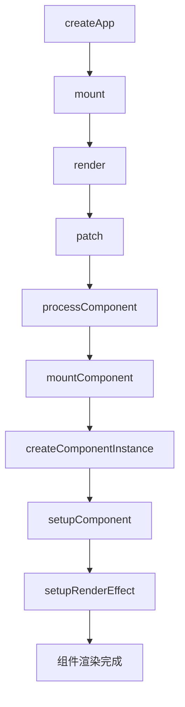

# 组件实例化流程

> 🔗 **关联笔记**：[[Vue3源码实战笔记]]
> 📅 **创建时间**：2024-12-24
> 📁 **源码位置**：`packages/runtime-core/src/component.ts`

---

## 📖 组件挂载流程



---

## 🔧 核心步骤

### 1. 创建组件实例

```typescript
function createComponentInstance(vnode, parent) {
  const instance = {
    vnode,
    type: vnode.type,
    parent,
    
    // 状态
    data: {},
    props: {},
    attrs: {},
    slots: {},
    
    // 生命周期
    isMounted: false,
    
    // 渲染相关
    render: null,
    proxy: null,
    
    // 其他
    emit: null,
    provides: parent ? parent.provides : {}
  }
  
  instance.emit = emit.bind(null, instance)
  
  return instance
}
```

### 2. 初始化组件

```typescript
function setupComponent(instance) {
  const { props, children } = instance.vnode
  
  // 初始化 props
  initProps(instance, props)
  
  // 初始化 slots
  initSlots(instance, children)
  
  // 调用 setup
  setupStatefulComponent(instance)
}

function setupStatefulComponent(instance) {
  const Component = instance.type
  
  // 创建代理
  instance.proxy = new Proxy(instance.ctx, PublicInstanceProxyHandlers)
  
  const { setup } = Component
  if (setup) {
    const setupResult = setup(instance.props, {
      attrs: instance.attrs,
      slots: instance.slots,
      emit: instance.emit
    })
    
    handleSetupResult(instance, setupResult)
  }
}
```

### 3. 设置渲染 Effect

```typescript
function setupRenderEffect(instance, container) {
  const componentUpdateFn = () => {
    if (!instance.isMounted) {
      // 首次挂载
      const subTree = (instance.subTree = instance.render.call(instance.proxy))
      patch(null, subTree, container)
      instance.isMounted = true
    } else {
      // 更新
      const nextTree = instance.render.call(instance.proxy)
      const prevTree = instance.subTree
      instance.subTree = nextTree
      patch(prevTree, nextTree, container)
    }
  }
  
  const effect = new ReactiveEffect(componentUpdateFn, () => {
    queueJob(instance.update)
  })
  
  instance.update = effect.run.bind(effect)
  instance.update()
}
```

---

## 📚 相关笔记

- [[Vue3源码实战笔记]] - 主笔记
- [[生命周期实现]] - 生命周期
- [[Props和Emit]] - 组件通信

#Vue3 #组件 #源码分析
