# 浏览器原理

## 概述

浏览器是一个复杂的软件系统，主要负责从服务器获取资源、解析并渲染网页内容。理解浏览器原理对于前端开发者优化性能、调试问题至关重要。

---

## 🏗️ 浏览器架构

### 多进程架构

现代浏览器（如 Chrome）采用多进程架构，主要包含：

| 进程类型 | 职责 |
|---------|------|
| **Browser 进程** | 主进程，负责地址栏、书签、前进后退、网络请求、文件访问等 |
| **Renderer 进程** | 渲染进程，负责页面渲染，每个 Tab 通常有独立的渲染进程 |
| **GPU 进程** | 处理 GPU 任务，如 3D CSS 效果、页面绑定 |
| **Plugin 进程** | 负责运行浏览器插件（如 Flash） |
| **Network 进程** | 处理网络请求 |

```
┌─────────────────────────────────────────────────────────┐
│                    Browser Process                       │
│  ┌─────────┐  ┌─────────┐  ┌─────────┐  ┌─────────┐    │
│  │  UI     │  │ Network │  │ Storage │  │  ...    │    │
│  └─────────┘  └─────────┘  └─────────┘  └─────────┘    │
└─────────────────────────────────────────────────────────┘
         │              │              │
    ┌────┴────┐    ┌────┴────┐    ┌────┴────┐
    │Renderer │    │Renderer │    │  GPU    │
    │Process 1│    │Process 2│    │ Process │
    └─────────┘    └─────────┘    └─────────┘
```

### 多进程的优势

- **稳定性**：一个页面崩溃不会影响其他页面
- **安全性**：进程隔离，沙箱机制保护
- **高性能**：多核 CPU 并行处理

---

## 🌐 导航流程（从输入 URL 到页面展示）

### 1. URL 解析与 DNS 查询

```mermaid
graph LR
    A[输入 URL] --> B[URL 解析]
    B --> C[检查缓存]
    C --> D[DNS 查询]
    D --> E[获取 IP 地址]
```



**DNS 查询顺序：**
1. 浏览器缓存
2. 操作系统缓存
3. 本地 hosts 文件
4. 路由器缓存
5. ISP DNS 服务器
6. 根 DNS 服务器

### 2. TCP 连接建立

```
客户端                                          服务器
   │                                              │
   │  ────────── SYN ──────────────────────────>  │
   │                                              │
   │  <────────── SYN + ACK ────────────────────  │
   │                                              │
   │  ────────── ACK ──────────────────────────>  │
   │                                              │
   └──────────── 三次握手完成 ────────────────────┘
```

### 3. HTTPS/TLS 握手（如果是 HTTPS）

- 协商加密算法
- 交换证书
- 生成会话密钥

### 4. 发送 HTTP 请求

```http
GET /index.html HTTP/1.1
Host: www.example.com
User-Agent: Mozilla/5.0
Accept: text/html
```

### 5. 接收响应

服务器返回 HTML、CSS、JavaScript 等资源。

---

## 🎨 渲染流程（关键渲染路径）

### 渲染引擎

| 浏览器 | 渲染引擎 |
|--------|---------|
| Chrome | Blink |
| Firefox | Gecko |
| Safari | WebKit |
| Edge | Blink |

### 渲染流程图

```
┌─────────┐   ┌─────────┐   ┌─────────┐   ┌─────────┐   ┌─────────┐
│  HTML   │──>│   DOM   │──>│ Render  │──>│ Layout  │──>│  Paint  │
│ Parser  │   │  Tree   │   │  Tree   │   │         │   │         │
└─────────┘   └─────────┘   └─────────┘   └─────────┘   └─────────┘
                  ↑              ↑
                  │              │
┌─────────┐   ┌───┴─────┐       │
│  CSS    │──>│ CSSOM   │───────┘
│ Parser  │   │  Tree   │
└─────────┘   └─────────┘
```

### 详细步骤

#### 1. 构建 DOM 树

```javascript
// HTML 字节流 → 字符 → Token → Node → DOM Tree
Bytes → Characters → Tokens → Nodes → DOM
```

```html
<!-- 原始 HTML -->
<html>
  <body>
    <div>Hello</div>
  </body>
</html>
```

转换为 DOM 树：
```
Document
└── html
    └── body
        └── div
            └── "Hello"
```

#### 2. 构建 CSSOM 树

```css
/* CSS */
body { font-size: 16px; }
div { color: blue; }
```

转换为 CSSOM：
```
body
├── font-size: 16px
└── div
    └── color: blue
```

#### 3. 构建渲染树（Render Tree）

- 结合 DOM 和 CSSOM
- 只包含可见元素
- `display: none` 的元素不会出现在渲染树中

#### 4. 布局（Layout / Reflow）

计算每个元素的几何信息：
- 位置（position）
- 大小（size）

```javascript
// 触发布局的操作
element.offsetWidth
element.getBoundingClientRect()
window.getComputedStyle()
```

#### 5. 绘制（Paint）

将渲染树转换为屏幕上的像素：
- 颜色
- 边框
- 阴影
- 文字

#### 6. 合成（Composite）

多个图层合成最终页面，GPU 加速。

---

## ⚡ JavaScript 引擎

### V8 引擎（Chrome/Node.js）

```
┌─────────────────────────────────────────────────────┐
│                     V8 Engine                        │
│  ┌──────────┐   ┌──────────┐   ┌──────────────┐    │
│  │  Parser  │──>│ Ignition │──>│  TurboFan    │    │
│  │(词法分析)│   │ (解释器) │   │(优化编译器)   │    │
│  └──────────┘   └──────────┘   └──────────────┘    │
│       ↓              ↓               ↓              │
│     AST        Bytecode       Optimized Code       │
└─────────────────────────────────────────────────────┘
```

### 执行流程

1. **Parser**：将源代码解析为 AST（抽象语法树）
2. **Ignition**：将 AST 编译为字节码并解释执行
3. **TurboFan**：对热点代码进行优化编译

---

## 🔄 事件循环（Event Loop）

### 执行模型

```
┌──────────────────────────────────────┐
│           Call Stack                  │
│  ┌─────────────────────────────┐     │
│  │   执行上下文 (函数)          │     │
│  └─────────────────────────────┘     │
└──────────────────────────────────────┘
              ↑
              │
    ┌─────────┴─────────┐
    │    Event Loop     │
    └─────────┬─────────┘
              │
    ┌─────────┴─────────────────────────┐
    │          Task Queue               │
    │  ┌────────────┐ ┌───────────────┐ │
    │  │ 宏任务队列  │ │ 微任务队列    │ │
    │  │(setTimeout)│ │(Promise.then)│ │
    │  └────────────┘ └───────────────┘ │
    └───────────────────────────────────┘
```

### 宏任务 vs 微任务

| 宏任务（Macro Task） | 微任务（Micro Task） |
|---------------------|---------------------|
| setTimeout | Promise.then/catch/finally |
| setInterval | MutationObserver |
| setImmediate | queueMicrotask |
| I/O | process.nextTick (Node.js) |
| UI 渲染 | |

### 执行顺序

```javascript
console.log('1'); // 同步

setTimeout(() => {
  console.log('2'); // 宏任务
}, 0);

Promise.resolve().then(() => {
  console.log('3'); // 微任务
});

console.log('4'); // 同步

// 输出顺序: 1, 4, 3, 2
```

**执行规则：**
1. 执行同步代码（主线程）
2. 清空微任务队列
3. 执行一个宏任务
4. 重复 2-3

---

## 🚀 性能优化

### 重绘（Repaint）与回流（Reflow）

| 类型 | 触发条件 | 性能影响 |
|-----|---------|---------|
| **回流** | 改变元素几何属性（位置、大小） | 高 |
| **重绘** | 改变元素外观（颜色、背景） | 中 |

### 优化建议

#### 减少回流
```javascript
// ❌ 不好的做法：多次触发回流
element.style.width = '100px';
element.style.height = '200px';
element.style.margin = '10px';

// ✅ 好的做法：一次性修改
element.classList.add('new-styles');
// 或
element.style.cssText = 'width: 100px; height: 200px; margin: 10px;';
```

#### 使用 DocumentFragment
```javascript
// ✅ 使用 DocumentFragment 批量操作 DOM
const fragment = document.createDocumentFragment();
for (let i = 0; i < 1000; i++) {
  const li = document.createElement('li');
  li.textContent = `Item ${i}`;
  fragment.appendChild(li);
}
document.getElementById('list').appendChild(fragment);
```

#### GPU 加速
```css
/* 触发 GPU 加速 */
.accelerated {
  transform: translateZ(0);
  /* 或 */
  will-change: transform;
}
```

---

## 🔒 浏览器安全

### 同源策略

**同源定义：** 协议 + 域名 + 端口 相同

```
https://example.com:443/page
  │         │        │
协议      域名      端口
```

### 跨域解决方案

| 方案 | 适用场景 |
|-----|---------|
| **CORS** | 最标准的跨域方案 |
| **JSONP** | 只支持 GET 请求 |
| **代理服务器** | 开发环境常用 |
| **postMessage** | iframe 通信 |

### XSS 防御

```javascript
// ❌ 危险：直接插入 HTML
element.innerHTML = userInput;

// ✅ 安全：转义特殊字符
function escapeHTML(str) {
  return str.replace(/[&<>"']/g, (match) => {
    const escapeMap = {
      '&': '&amp;',
      '<': '&lt;',
      '>': '&gt;',
      '"': '&quot;',
      "'": '&#39;'
    };
    return escapeMap[match];
  });
}
```

---

## 📦 缓存机制

### 缓存类型

```
┌────────────────────────────────────────────────────┐
│                   缓存层级                          │
│                                                     │
│  ┌─────────────┐                                   │
│  │ Memory Cache│  ← 最快，内存缓存                  │
│  └─────────────┘                                   │
│         ↓                                          │
│  ┌─────────────┐                                   │
│  │ Disk Cache  │  ← 磁盘缓存                       │
│  └─────────────┘                                   │
│         ↓                                          │
│  ┌─────────────┐                                   │
│  │ Service     │  ← 离线缓存                       │
│  │ Worker      │                                   │
│  └─────────────┘                                   │
└────────────────────────────────────────────────────┘
```

### HTTP 缓存策略

#### 强缓存

```http
# 响应头
Cache-Control: max-age=31536000
Expires: Wed, 21 Oct 2025 07:28:00 GMT
```

#### 协商缓存

```http
# 请求头
If-Modified-Since: Wed, 21 Oct 2024 07:28:00 GMT
If-None-Match: "abc123"

# 响应头
Last-Modified: Wed, 21 Oct 2024 07:28:00 GMT
ETag: "abc123"
```

---

## 📚 相关知识

- [[AST抽象语法树]]
- [[响应式原理-computed]]
- [[编译优化策略]]

---

## 🔗 参考资料

- [Chrome Developers - Inside look at modern web browser](https://developer.chrome.com/blog/inside-browser-part1)
- [MDN - 浏览器的工作原理](https://developer.mozilla.org/zh-CN/docs/Web/Performance/How_browsers_work)
- [V8 引擎官网](https://v8.dev/)

---

#前端 #浏览器 #性能优化 #JavaScript
